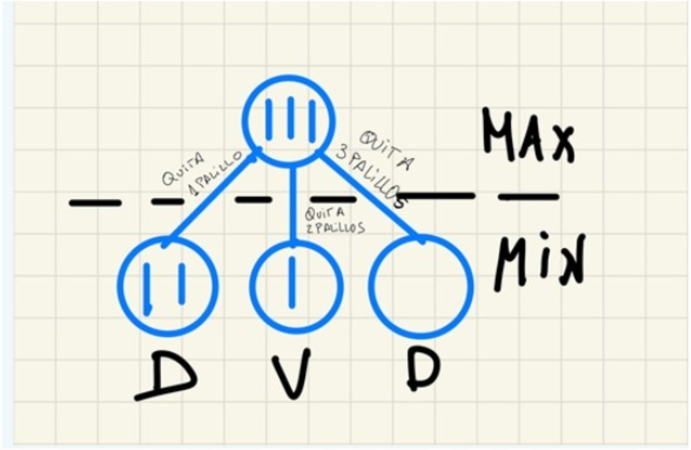

 

# Inteligencia Artificial

- **Autor:** Arturo Olivares Martos
- **Descripción:** Recopilación de preguntas Tipo Test de la asignatura de Inteligencia Artificial. Se han obtenido de fuentes diversas, por lo que si faltasen, sobrasen o estuviesen mal formuladas, por favor, se ruega nos lo hagan saber para corregirlo.

---

1. ¿Cuál de los siguientes métodos de búsqueda es un caso particular de búsqueda primero el mejor?:
    - (x) Algoritmo A*.
    - ( ) Búsqueda en profundidad.
    - ( ) Algortimo genético.

2. ¿El uso de una función heurística garantiza que un método de búsqueda consiga la solución óptima?:
    - ( ) Siempre.
    - ( ) Nunca.
    - (x) Depende del algoritmo y de la heurística.

3. En el algoritmo A* ABIERTOS representa:
    - ( ) El conjunto de nodos generados y explorados.
    - (x) El conjunto de nodos generados y no explorados.
    - ( ) El conjunto de nodos no generados y explorados.
    - ( ) El conjunto de nodos no generados y no explorados.

4. En el algoritmo A* cuando un sucesor corresponde con un nodo que ya estaba en CERRADOS:
    - ( ) el nodo se revisa para determinar cuál es su mejor sucesor, y en el caso de que haya cambio se propaga al padre del nodo.
    - ( ) el nodo se revisa para determinar cuál es su mejor padr(correcta, pero está incompleta).
    - ( ) el nodo de elimina.
    - (x) el nodo se revisa para determinar cuál es su mejor padre, y en el caso de que haya cambio se propaga dicho cambio a los sucesores.

5. En el algoritmo A* el enlace al mejor padre determina una estructura de:
    - (x) árbol representando los mejores caminos desde cualquier nodo a la raíz.
    - ( ) árbol representando los mejores descendientes de cada nodo.
    - ( ) grafo con todos los descendientes desde cualquier nodo al objetivo.

6.  Las heurísticas son:
    - ( ) funciones usadas en algunos problemas.
    - (x) criterios, métodos o principios para decidir cuál de entre varias acciones promete ser la mejor para alcanzar una meta.
    - ( ) criterios, métodos o principios para obtener el óptimo.

7.  Un juego es determinístico porque:
    - ( ) Siempre se puede determinar una solución.
    - (x) Siempre se pueden determinar los resultados de los movimientos de los jugadores.
    - ( ) Un jugador puede determinar siempre una estrategia ganadora.

8.  Hay una diferencia destacable entre un estado de un juego y un estado de un problema de búsqueda heurística y es que:
    - ( ) En un estado de un juego no se representa la situación del mundo.
    - ( ) En un estado de un juego no se representa una valoración numérica sobre el estado.
    - (x) En un estado de un juego hay que representar el jugador que le toca mover.

9.  Un juego puede considerarse como un caso de sistema multiagente _______:
    - (x) Competitivo.
    - ( ) Cooperativo.

10. En un juego inicialmente hay 3 palillos sobre la mesa, y dos jugadores Max y Min. Max comienza el juego, y podrá quitar 1, 2 o 3 palillos. Le sigue Min, que también podrá quitar 1, 2 ó 3 palillos. Estas acciones se repiten hasta que último palillo, en cuyo caso pierde el juego. ¿La figura muestra el árbol de este juego?: 
    - ( ) Sí, porque todos los nodos min están bien valorados.
    - ( ) Sí, porque los nodos min son terminales.
    - (x) No, porque no todos los nodos terminales están etiquetados.
    - ( ) No, porque faltan operadores por aplicar al nodo max.

11. Las técnicas de juegos se llaman de búsqueda con adversario porque:
    - (x) Los agentes usan valoraciones de los estados terminales opuestas.
    - ( ) Los agentes usan repertorios de acciones opuestos.
    - ( ) Los agentes usan estados iniciales opuestos.

12. Un estado terminal en un juego bipersonal es un estado en el que:
    - ( ) hay empate entre los jugadores.
    - ( ) los dos jugadores ganan.
    - ( ) los dos jugadores pierden.
    - (x) no hay más movimientos aplicables y el juego finaliza.

13. Un juego bipersonal con información perfecta se considera un laboratorio de interés para la IA porque:
    - (x) Tiene un repertorio de acciones pequeño y aun así son duros de resolver.
    - ( ) Siempre se puede encontrar una solución óptima con una buena heurística.
    - ( ) Es más difícil de representar que juegos físicos, como el “RoboSoccer” o Fútbol Robótico.

14. Al inicio de la exploración de un árbol de juego:
    - ( ) Todos los nodos valen inicialmente 0.
    - ( ) Todos los nodos valen inicialmente 0 menos los terminales.
    - (x) Todos los nodos tienen un valor desconocido menos los terminales.

15. El tamaño aproximado del espacio de nodos a explorar en el ajedrez, que tiene un factor de ramificación promedio de 35 y una profundidad media de 50 movimientos por cada jugador es de:
    - (x) \\(O(35^{100})\\).
    - ( ) \\(O(100^{35})\\).
    - ( ) \\(O(35*{100})\\).
    - ( ) \\(O(e^{-\frac{35}{100}})\\).

16. En un juego una estrategia contingente:
    - ( ) Es un camino lineal entre el estado inicial y un estado terminal que incluye nodos max y nodo.
    - (x) Es un grafo Y/O que representa movimientos de max y todos los posibles movimientos de op.

17. La solución de un juego permite indicar a cada jugador:
    - (x) Qué resultado puede esperar y cómo alcanzarlo.
    - ( ) Un camino lineal para encontrar un estado ganador.

18. Las valoraciones de los nodos terminales de un juego se realizan considerando el punto de vista de _:
    - (x) max.
    - ( ) min.

19. En los juegos bipersonales con información perfecta:
    - (x) Los jugadores actúan cada uno racionalmente, es decir, cada uno trata de obtener el máximo beneficio.
    - ( ) Los jugadores actúan cada uno racionalmente, es decir, cada uno trata de maximizar su pérdia.

20. Un juego de suma nula:
    - ( ) Hay reparto de beneficio entre los jugadores y la suma de beneficios es 0.
    - ( ) El resultado final del juego es 0.
    - (x) Cada situación final el beneficio de un jugador es total y la pérdida del oponente es total.

21. Es necesario valorar  situaciones o asociar una utilidad a situaciones distintas a las terminales  para poder resolver un juego:
    - (x) Verdadero.
    - ( ) Falso.

22. Un juego con información perfecta es un caso de sistema multiagente con dos jugadores en el toda la información del tablero está disponible para cada jugador.:
    - (x) Verdadero.
    - ( ) Falso.

23. El caso promedio la poda alfa beta permite profundizar:
    - ( ) el triple que un procedimiento minimax con el mismo esfuerzo.
    - (x) un \\(33 \%\\) más que un procedimiento minimax con el mismo esfuerzo.
    - ( ) el doble que un procedimiento minimax con el mismo esfuerzo.

24. En el algoritmo minimax podemos cambiar el jugador `MAX` por el jugador `MIN` sin más que:
    - ( ) Cambiar el orden de la exploración sin alterar ningún otro elemento.
    - ( ) Modificar la función heurística sumando `-1` a todos sus valores.
    - (x) Cambiar el orden de la exploración y el signo de la función heurística.

25. En teoría de juegos, minimax es:
    - ( ) un método para encontrar la salida a un laberinto.
    - ( ) un algoritmo para resolver una partida de ajedrez.
    - (x) un método de decisión para minimizar la pérdida máxima esperada en juegos con adversario, perfecta y suma nula.
    - ( ) un tipo de agente deliberativo.
    - ( ) un método de decisión para maximizar la pérdida mínima esperada en juegos con adversario, perfecta y suma nula.

26. En un juego con componente aleatoria, si realizamos un cambio de escala en los valores ¿la variantetipo de juegos elegirá la misma jugada?:
    - ( ) Si, no depende de los cambios de escala siempre que se conserve el orden de los valores.
    - (x) No siempre, pues puede cambiar el orden de la esperanza matemática de las opciones de unaconserve el orden de los valores.

27. La cota alfa se calcula como el:
    - (x) el valor máximo de los nodos `MAX` en el camino del nodo a la raíz.
    - ( ) el valor máximo de los nodos `MIN` en el camino del nodo a la raíz.
    - ( ) el valor mínimo de los nodos `MIN` en el camino del nodo a la raíz.
    - ( ) el valor mínimo de los nodos `MIN` en el árbol del juego.
    - ( ) el valor máximo de los nodos `MAX` del árbol del juego.

28. La efectividad de la poda alfa-beta del algoritmo minimax depende del orden en que se exploren las jugadas:
    - (x) cierto.
    - ( ) falso.
    - ( ) depende de la función de evaluación estática usada.

29. En el contexto de búsqueda en juegos con una profundidad de corte o limitada, una posición estable:
    - ( ) a. Una posición del juego en la que la valoración de sus sucesores no cambia respecto a la posicion actual.
    - (x) Una posición del juego desde la no se producen variaciones drásticas de la valoración de sus posición actual.
    - ( ) Una posición a la que se puede volver para iniciar una nueva estrategia contingente.

30. Una función de valoración de nodos intermedios de un juego:
    - ( ) No tiene que contemplar situaciones terminales del juego.
    - (x) Tiene que contemplar situaciones terminales del juego, valorándolas con  \\(-\infty\\) si gana `MIN` y  \\(+\infty\\) si pierde `MIN`.
    - ( ) Tiene que contemplar situaciones terminales del juego, valorándolas con  \\(-\infty\\) si pierde `MIN` y  \\(+\infty\\) si gana `MIN`.

31. Una regla general como "Todas las casillas azules de un mapa pueden transitarse si el agente tiene bikini":
    - ( ) se puede representar más adecuadamente con un modelo icónico que con un modelo descriptrivo.
    - (x) se puede representar más adecuadamente con un modelo descriptivo que con un modelo icónico.
    - ( ) no puede representarse ni con un modelo descriptivo ni con un modelo icónico.

32. La información que se almacena en un nodo de un espacio de estados es un ejemplo de:
    - (x) un modelo de representación icónico.
    - ( ) un modelo de representación descriptivo.
    - ( ) un modelo de presentación ad-hoc.

33. El cálculo proposicional es decidible, lo cual significa que:
    - ( ) Se puede usar para tomar decisiones a partir de un conjunto de fórmulas.
    - (x) Se puede determinar en tiempo finito si una proposición es deducible de un conjunto de fórmulas.
    - ( ) Se puede garantizar que si una fórmula es cierta entonces se puede decidir su certeza.

34. La relación “X es el padre de Y”:
    - ( ) se puede representar más adecuadamente con proposiciones que con predicados.
    - (x) se puede representar más adecuadamente con predicados que con proposiciones.
    - ( ) solo puede representarse con predicados.

35. Un árbol de demostración:
    - (x) es una representación del proceso de demostración de una fórmula bien formada.
    - ( ) es una representación del espacio de estados en la búsqueda de una fórmula bien formada.
    - ( ) es una representación del espacio de fórmulas donde se debe encontrar una demostración.

36. El modus ponens:
    - ( ) es una regla de inferencia para modelos icónicos.
    - (x) es una regla de inferencia en lógica en lógica proposicional y de predicados.
    - ( ) es una regla de inferencia solo aplicable en lógica proposicional.

37. Si partimos de dos cláusulas, una en la que se afirma que “no llueve o hace frío” y otra que en la que hace frío”, la regla de resolución aplicada a ambas establece que:
    - (x) hace frío.
    - ( ) no llueve.
    - ( ) no se pueden resolver, son cláusulas inconsistentes.

38. La instanciación universal nos permite deducir:
    - ( ) reglas generales a partir de casos particulares.
    - (x) casos particulares a partir de reglas generales.
    - ( ) la instanciación no nos permite deducir, nos permite inferir.

39. Para representar con predicados la información sobre una Asignatura, el Curso en que se imparte y el cuatrimestre:
    - ( ) se puede usar un único predicado `asignatura(A,C,Cu)` donde `A` es una variable que representa y `Cu` el cuatrimestre.
    - ( ) se pueden usar dos predicados, `asignatura-curso(A,C)` y `asignatura-cuatrimestre(A,Cu)` donde representa la asignatura, `C` el curso y `Cu` el cuatrimestre.
    - ( ) ninguna de las otras respuestas es cierta porque no se pueden usar predicados para represenen una base de datos.
    - (x) se puede usar un único predicado o dos, tal y como se explica en las otras dos opciones.

40. ¿Es eficiente la resolución en lógica de predicados?:
    - ( ) No, solo sirve como concepto teórico.
    - (x) Si, siempre que nos limitemos a utilizar cláusulas de Horn.
    - ( ) Si, siempre encuentra en tiempo eficiente las demostraciones.

41. ¿Cuál de los siguientes es un tipo de aprendizaje?:
    - ( ) Aprendizaje normal.
    - ( ) Aprendizae por eliminación.
    - (x) Aprendizaje supervisado.

42. En un sistema basado en el conocimiento, el motor de inferencia:
    - ( ) contiene los hechos inferidos y las reglas para inferir.
    - (x) permite razonar sobre el conocimiento de la base de conocimiento y los datos proporcionados por un usuario.
    - ( ) es independiente del modelo de representación.

43. ¿Cuáles son los dos métodos de aprendizaje supervisado?:
    - [x] Métodos basados en instancias.
    - [ ] Métodos basado en grafos.
    - [x] Métodos basados en modelos.
    - [ ] Métodos basados en funciones.

44. ¿Cuál o cuáles de las siguientes afirmaciones acerca de los algoritmos de búsqueda no informada son ciertas?:
    - (x) La búsqueda en anchura garantiza obtener la solución óptima siempre y cuando el coste sea unitario.
    - ( ) Los algoritmos de búsqueda no informada requieren de información heurística para que funcionen.
    - ( ) La búsqueda en profundidad garantiza obtener la solución óptima siempre que el coste sea unitario.

45. ¿Cuáles de las siguientes opciones son correctas:
    - ( ) El agente deliberativo dispone de un modelo de los efectos de sus acciones sobre el mundo.
    - ( ) El agente deliberativo dispone de un modelo en el mundo que habita.
    - ( ) El agente deliberativo reacciona a los cambios que percibe, aunque no estén en modelo.
    - (x) El agente delibertaivo dispone tanto de un modelo de los efectos de sus acciones sobre el mundo como de un modelo en el mundo que habita.

46. ¿Cuáles  de los siguientes métodos son búsqueda sin información?:
    - ( ) búsqueda en profundidad pero no búsqueda en anchura.
    - ( ) búsqueda en anchura, pero no búsqueda en profundidad.
    - (x) búsqueda en anchura, búsqueda en profundidad.

47. ¿Cuántos caminos se mantendrán en memoria en la búsqueda en profundidad retroactiva?:
    - ( ) 2.
    - (x) 1.
    - ( ) todos.
    - ( ) 3.

48. ¿Qué estrategia de control utiliza un método de escalada?:
    - ( ) Exploración de grafos.
    - (x) Irrevocable.
    - ( ) Retroactiva.

49. ¿Qué representan los nodos cuando se usa la estructura de grafo dirigido para representar un Artificial? ¿Y los arcos?:
    - ( ) Nodos: un objeto; Arcos: un camino.
    - (x) Nodos: un estado del sistema; Arcos: una posible acción.
    - ( ) Nodos: una posible acción; Arcos: un estado del sistema.
    - ( ) Ninguna de las respuestas anteriores es cierta.

50. ¿Sería viable generar el grafo completo para representar el espacio de estados del ajedrez?:
    - ( ) Si, pero es más eficiente trabajar con el grafo implícito.
    - (x) No, tendría demasiados nodos.

51. ¿De entre la búsqueda en anchura y en profundidad retroactiva, ¿cuál de los dos usa menos memoria?:
    - ( ) La búsqueda en anchura.
    - (x) La búsqueda en profundidad retroactiva.
    - ( ) Los dos usan la misma cantidad de memoria.
    - ( ) No usan memoria.

52. ¿En el problema del mono y los plátanos, ¿qué tipo de agente sería más eficaz?:
    - ( ) Social.
    - ( ) Reactivo.
    - (x) Deliberativo.

53. ¿En la búsqueda en anchura es necesario ir analizando desde el estado inicial todos los sucesos para pasar al nivel siguiente en el árbol de búsqueda?:
    - ( ) solo en los primeros pasos.
    - ( ) no.
    - (x) si.

54. ¿En la búsqueda en profundidad retroactiva, el contenido de la memoria almacenada es?:
    - (x) el camino que se está explorando.
    - ( ) el nodo actual.
    - ( ) todos los caminos que se han explorado.

55. ¿La búsqueda en profundidad retroactiva es una estrategia de búsqueda:
    - ( ) especulativa.
    - (x) tentativa.
    - ( ) explicativa.

56. La principal diferencia entre el algoritmo de escalada simple y el algoritmo de escalada por la máxima pendiente es:
    - ( ) el uso de la heurística sobre los nodos sucesores y el criterio de parada.
    - (x) los estados que se tienen en cuenta para la generación del siguiente estado.
    - ( ) la posibilidad de vuelta atrás y el criterio de parada.

57. ¿Los métodos heurísticos en general no garantizan la solución óptima, pero producen resultados que satisfacen la resolución del problema?:
    - ( ) Falso.
    - (x) Verdadero.

58. ¿Los problemas fundamentales de un método de escalada son?:
    - ( ) Cálculo de la heurística.
    - ( ) Mesetas.
    - ( ) Máximos locales.
    - (x) Mesetas y Máximos Locales.

59. Qué tipo de aprendizaje aprende una función a partir de ejemplos de sus entradas y salidas?:
    - ( ) Aprendizaje por refuerzo.
    - ( ) Aprendizaje no supervisado.
    - (x) Aprendizaje supervisado.

60. Selecciona la definición que mejor se ajusta al concepto de espacio de estados:
    - (x) Grafo cuyos nodos representan las configuraciones alcanzables (los estados válidos) y explicitan las acciones posibles.
    - ( ) Es la representación de conocimientos del problema, ya generada al inicio del problema en la ejecución del agente.
    - ( ) Grafo cuyos nodos representan acciones, algunas imposibles y otras posibles; el agente elige la que mejora le satisfaga.

61. Una ventaja de los métodos de escalada es que son siempre fáciles de implementar:
    - (x) tan solo los métodos de escalada simples.
    - ( ) tan solo cuando no se incluyen probabilidades.
    - ( ) siempre.

62. ¿Cuál de entre los siguientes algoritmos de escalada tiene más probabilidad de caer en óptimo?:
    - ( ) escalada por máxima pendiente.
    - ( ) enfriamiento simulado.
    - (x) escalada simple.

63. ¿Cuál de entre los siguientes algoritmos de escalada reduce la posibilidad de caer en óptimos locales?:
    - ( ) escalada simple.
    - ( ) escalada por máxima pendiente.
    - (x) enfriamiento simulado.

64. Cuando la salida de un árbol de decisión es una variable continua, el problema se denomina:
    - ( ) Completo.
    - ( ) continuo.
    - (x) regresión.

65. ¿Qué hace diferente a los algoritmos genéticos de los otros métodos de escalada?:
    - (x) el uso de conjuntos de estados y operaciones sobre conjuntos de estados.
    - ( ) el uso de decisiones probabilísticas.
    - ( ) el uso de estrategias irrevocables.

66. ¿Qué representa en el problema la adecuación con el entorno en un algoritmo genético?:
    - (x) el valor de la función heurística.
    - ( ) la población.
    - ( ) el operador de selección.

67. Cuando se resuelve un problema con un algoritmo genético tanto la condificación del problema:
    - ( ) es conveniente que se adapten al modelo definido por el algoritmo genético.
    - ( ) no es necesario que se adapten al modelo definido por el algoritmo genético.
    - (x) es necesario que se adapten al modelo definido por el algoritmo genético.

68. ¿De los siguientes algoritmos ¿cuál tiene más posibilidades de caer en un máximo o mínimo local?:
    - (x) Escalada máxima pendiente.
    - ( ) Profundizaje iterativo.
    - ( ) Algoritmos genéticos.

69. ¿El algoritmo de enfriamiento simulado es una variante de los métodos de escalada que se cambia en algunos casos?:
    - ( ) estados diferentes al actual.
    - ( ) estados mejores que el actual.
    - (x) estados peores que el actual.

70. ¿El algoritmo de escalada estocástico selecciona el siguiente estado?:
    - ( ) Aleatoriamente entre todos los descendientes.
    - ( ) Aleatoriamente entre todos los descendientes que mejoran al actual y con una probabilidad constante.
    - (x) Aleatoriamente entre todos los descendientes que mejoran al actual y con una probabilidad descendiente proporcional al valor de la heurística del mismo.
    - ( ) Aleatoriamente entre todos los descendientes que mejoran al actual.

71. ¿En el algoritmo de enfriamiento simulado la energía representa?:
    - ( ) un valor global del sistema.
    - ( ) la cercanía al óptimo.
    - (x) la función heurística.

72. En el algoritmo simulado la temperatura representa:
    - ( ) la cercanía al óptimo.
    - (x) un parámetro artificial que permite controlar la conducta del algoritmo a lo largo del tiempo.
    - ( ) el incremento de la función heurística.
    - ( ) un parámetro artificial que permite controlar la definición de la función heurística a lo largo del tiempo.

73. Los métodos de escalada tienen como objetivo pasar irrevocablemente desde un nodo al nodo siguiente:
    - ( ) a todos los nodos sucesores.
    - (x) que mejore al nodo actual.
    - ( ) ninguna de las anteriores.

74. En el algoritmo de búsqueda A*, \\(g(n)\\) expresa el coste estimado desde el nodo \\(n\\) hasta el nodo del mejor camino hasta el momento desde el nodo inicial al \\(n\\):
    - ( ) Verdadero.
    - (x) Falso.

75. Para un nodo, el algoritmo A* la función \\(h\\) es un valor que no cambia a lo largo del algoritmo:
    - (x) Verdadero.
    - ( ) Falso.

76.  Si realizamos un cambio de escala en los valores de la función de evaluación estática, por ejemplo, multiplicar el valor por 10, ¿el algoritmo minimax elige la misma jugada?:
    - ( ) Solo si el cambio de escala aumenta el valor actual.
    - ( ) Solo si el cambio de escala disminuye el valor actual.
    - (x) Sí, no depende de los cambios de escala.

77.  Un problema para el que existe una resolución algorítmica ¿podría ser un problema de Inteligencia Artificial?:
    - ( ) Si, esos problemas se incluyen siempre en Inteligencia Artificial.
    - (x) Podría ser, dependiendo del tipo de solución que tenga el problema.
    - ( ) No, ya existe un algoritmo que lo resuelve.

78.  ¿En qué consiste actuar racionalmente?:
    - ( ) en percibir y actuar.
    - ( ) en dar una solución aunque no sea la mejor.
    - ( ) en resolver el problema de forma óptima.
    - (x) en actuar de la forma correcta según la información que se posee.

79.  En su definición más estricta, una arquitectura reactiva es aquella que:
    - ( ) no incluye ninguna clase de modelo centralizado de representación simbólica del mundo, y hace uso de razonamiento complejo.
    - (x) no incluye ninguna clase de modelo centralizado de representación simbólica del mundo, y/o no hace uso de razonamiento complejo sobre dicha representación.
    - ( ) incluye una clase de modelo centralizado de representación simbólica del mundo, y hace uso de razonamiento complejo.
    - ( ) incluye una clase de modelo centralizado de representación simbólica del mundo, y no hace uso de razonamiento complejo.

80.  El aprendizaje basado en instancias:
    - ( ) representa el conocimiento mediante reglas.
    - (x) representa el conocimiento mediante los mismos ejemplos.
    - ( ) representa el conocimiento mediante árboles de decisión.

81.  La búsqueda primero el mejor o por el mejor nodo hace uso de una estrategia de control:
    - (x) de exploración en grafos.
    - ( ) irrevocable.
    - ( ) retroactiva.

82.  ¿Cuál de los siguientes algoritmos tienen una componente aleatoria?:
    - ( ) Algoritmo A*.
    - (x) Algoritmos genéticos.
    - ( ) Algoritmo de escalada por la máxima pendiente.
    - ( ) Algoritmo de escalada simple.

83.  ¿Es esencial el uso de memoria en un agente reactivo?:
    - ( ) no, porque seguiría siendo inteligente, aunque no tuviera memoria.
    - (x) no, pero incluirla provocaría una mejora de la eficiencia y el comportamiento del agente.
    - ( ) no, porque si se incluye dicha memoria pasa a ser un agente deliberativo.
    - ( ) si, porque es imposible que un agente funcione sin memoria.

84.  Todo juego bipersonal con información perfecta y suma nula tiene solución.:
    - (x) La afirmación es cierta pero no podemos conseguir resolver de forma práctica juegos complejos.
    - ( ) La afirmación es falsa, el ajedrez es un ejemplo de juego que no se puede resolver.
    - ( ) La verdad de la afirmación depende de la complejidad del juego y de la implementación del algoritmo.

85.  En el contexto del aprendizaje automático, ¿Qué es una instancia?:
    - (x) Una observación de una situación conocida en un problema.
    - ( ) Un recurso del sistema.
    - ( ) Un algoritmo de búsqueda.

86.  Con qué método de búsqueda se obtienen siempre la solución con un número menor de pasos?:
    - ( ) Descenso iterativo.
    - ( ) Búsqueda en profundidad.
    - ( ) Búsqueda en anchura.
    - ( ) Enfriamento simulado.
    - ( ) Algoritmo genético.
    - (x) Descenso iterativo y Búsqueda en anchura.

87.  El test de Turing tiene que ver con:
    - ( ) sistemas que piensan como humanos.
    - ( ) sistemas que actúan racionalmente.
    - (x) sistemas que actúan como humanos.
    - ( ) sistemas que piensan racionalmente.

88.  Cuando se dice que un agente es capaz de razonar sobre un modelo del mundo para decidir qué hacer para lograr un objetivo, estamos hablando de un agente:
    - ( ) reactivo.
    - ( ) social.
    - (x) deliberativo.

89.  El subsistema de explicación de un sistema experto basado en reglas tiene como misión:
    - ( ) deducir los hechos más importantes que se han utilizado en el proceso.
    - (x) justificar como se ha llegado a la decisión propuesta por el sistema.
    - ( ) obtener una retroalimentación de la decisión tomada.

90.  ¿Cuál de las siguientes opciones es incorrecta?:
    - (x) El agente deliberativo reacciona a los cambios que percibe, aunque no estén en su modelo del mundo.
    - ( ) El agente deliberativo dispone de un modelo de los efectos de sus acciones sobre el mundo.
    - ( ) El agente deliberativo dispone de un modelo del mundo en el que habita.

91.  En el algoritmo A* usando \\(f = g+h\\), la función \\(g\\) es un valor asociado a cada estado que no cambia a lo largo del tiempo:
    - ( ) Es falso, el valor cambia en función de la heurística empleada.
    - (x) Es falso, el valor puede cambiar.
    - ( ) Es cierto, ese valor nunca cambia.

92.  En el algoritmo de poda alfa-beta, un nodo `MIN` se puede podar cuando:
    - ( ) su valor actual es menor o igual que la cota beta.
    - ( ) su valor actual es mayor que la cota alfa.
    - (x) su valor actual es menor o igual que la cota alfa.
    - ( ) su valor actual es mayor que la cota beta.

93.  Cuando tengamos más de una hipótesis que satisfaga todos los ejemplos debemos elegir:
    - (x) la más simple.
    - ( ) la más difícil.
    - ( ) la primera que se haya obtenido.
    - ( ) la última que se haya obtenido.
    - ( ) podemos elegir cualquiera.

94.  Señalar de entre los siguientes cuál es un modelo de representación del conocimiento:
    - ( ) el campo de potencial.
    - (x) la lógica de predicados.
    - ( ) los algoritmos genéticos.

95.  En un grafo Y/O si tenemos un nodo O, debemos:
    - ( ) resolver el subproblema asociado y devolverlo.
    - ( ) resolver todos sus hijos por separado, si todos están resueltos el nodo padre está resuelto, en otro caso el nodo padre no se puede resolver.
    - (x) resolver un nodo hijo para ver si está resuelto, si es así, el padre está resuelto, en caso contrario comprobar con otro hijo, si ninguno de los nodos hijos se puede resolver, el nodo padre tampoco.

96.  El enfriamiento simulado consiste en:
    - ( ) definir los valores de las probabilidades del modelo.
    - ( ) definir el número de iteraciones y el valor de la constante K.
    - (x) definir la temperatura de inicio y el cambio de temperatura en las diferentes iteraciones.

97.  En el algoritmo A* usando la fórmula \\(f = g+h\\) en cada nodo, ¿qué es la función \\(g\\)?:
    - ( ) Es una estimación del mejor coste para ir desde el nodo actual al nodo objetivo.
    - ( ) Es una estimación del mejor coste para ir desde el estado inicial al estado objetivo pasando por el nodo actual.
    - (x) Es una estimación del mejor coste para ir desde el estado inicial hasta el nodo actual.

98.  En un juego la incertidumbre producida por la tirada de un dado se mide:
    - (x) con el caso promedio.
    - ( ) con el caso más desfavorable.
    - ( ) con el caso más favorable.

99.  ¿Cuál de las siguientes herramientas no debería emplearse para construir un agente reactivo?:
    - ( ) Un sistema basado en reglas de producción.
    - ( ) Variables de estado.
    - ( ) Una tabla entrada-salida.
    - (x) Un sistema de búsqueda.

100. En el algoritmo de poda alfa-beta, beta es:
    - ( ) el mayor valor actual de entre los nodos `MAX` en el camino que hay desde el nodo actual al nodo solución.
    - (x) el menor valor actual de entre los nodos `MIN` en el camino que hay desde el nodo actual al nodo de inicio.
    - ( ) el menor valor actual de entre los nodos `MIN` en el camino que hay desde el nodo actual al nodo solución.
    - ( ) el mayor valor actual de entre los nodos `MAX` en el camino que hay desde el nodo actual al nodo de inicio.

101. La búsqueda en anchura permite obtener la solución con menor número de acciones:
    - (x) Sí.
    - ( ) depende del problema.
    - ( ) no.

102. En el problema del mono y los plátanos, donde el mono tiene que determinar una serie de acciones para coger un plátano colgado del techo conociendo los objetos presentes en la habitación, ¿qué tipo de agente sería más apropiado?:
    - ( ) Un agente social.
    - (x) Un agente deliberativo.
    - ( ) Un agente reactivo.

103. La arquitectura de subsunción:
    - ( ) consiste en usar ejemplos para aprender el comportamiento del agente y usar ese comportamiento para determinar la acción más apropiada.
    - ( ) consiste en seleccionar reglas usando una determinada ordenación y comprobar si se cumple una condición para asociarle la acción correspondiente.
    - (x) consiste en usar módulos de comportamiento que se activan y que con una determinada prioridad devuelven una acción a aplicar.

104. Un algoritmo de aprendizaje es bueno si:
    - ( ) produce hipótesis que hacen un buen trabajo al evaluar clasifacaciones de ejemplos observados previamente.
    - (x) produce hipótesis que hacen un buen trabajo al evaluar clasificaciones de ejemplos no han sido observados.
    - ( ) hace un buen trabajo produciendo clasificaciones de las diferentes hipótesis observadas.

105. Se dice que un problema de aprendizaje es realizable si el espacio de hipotesis:
    - (x) contiene a la función verdadera.
    - ( ) es lo suficientemente grande.
    - ( ) es continuo.
    - ( ) se representa mediante un modelo.
    - ( ) es finito.

106. Una hipótesis es consistente si:
    - ( ) es completa.
    - (x) satisface a los datos.
    - ( ) generaliza el conocimiento.

107. En el algoritmo A* CERRADOS representa:
    - ( ) el conjunto de nodos no generados y explorados.
    - ( ) el conjunto de nodos no generados y no explorados.
    - ( ) el conjunto de nodos generados y no explorados.
    - (x) el conjunto de nodos generados y explorados.

108. En el algoritmo minimax el valor minimax `V(J)` de un nodo `J` de la frontera de búsqueda es ___ al de su función de evaluación estática.:
    - ( ) menor.
    - ( ) diferente.
    - ( ) mayor.
    - (x) igual.

109. La complejidad de un juego se mide:
    - ( ) con el resultado de multiplicar la profundidad por la anchura del árbol del juego.
    - ( ) con la profundidad del árbol del juego.
    - ( ) con la anchura del árbol del juego.
    - ( ) con el número de nodos que se procesan.
    - (x) con \\(B^P\\) donde \\(B\\) es el factor de ramificación y \\(P\\) la profundidad.

110. Las bases de conocimiento:
    - ( ) son dinámicas, pueden incorporar siempre nuevos datos a lo largo del tiempo.
    - ( ) son estáticas, no varían a lo largo del tiempo dado que pueden deducir nuevo conocimiento en cualquier momento.
    - (x) pueden ser estáticas o dinámicas dependiendo del campo que trate y las necesidades que se tengan que cubrir.

111. En el contexto de los problemas de búsqueda ¿qué es el factor de ramificación?:
    - (x) El número promedio de descendientes por nodo.
    - ( ) Un parámetro que determina la probabilidad de mutación en un algoritmo genético.
    - ( ) Una constante asociada al algoritmo de enfriamiento simulado.

112. ¿Cuál de estos problemas no es de interés para la inteligencia artificial?:
    - (x) Apagar automáticamente un calefactor cuando haya más de 30ºC.
    - ( ) Jugar al ajedrez.
    - ( ) Apagar automáticamente un calefactor cuando se perciba sensación de calor.
    - ( ) Invertir en bolsa.

113. Los sistemas expertos son un ejemplo de:
    - ( ) Sistemas que actúan racionalmente.
    - ( ) Sistemas que piensan como humanos.
    - (x) Sistemas que actúan como humanos.
    - ( ) Ninguna de las otras respuestas.

114. La denominada edad oscura de la I.A., fue debida a que:
    - (x) Se necesitaba un gran conocimiento para resolver problemas específicos y se descubrió la complejidad de algunos problemas.
    - ( ) El trabajo de investigación sobre la IA se desarrollaba en sótanos oscuros.
    - ( ) Se perdió totalmente el interés por la IA, debido a su dificultad.

115. La Inteligencia Artificial surge a partir (seleccionar solo una opción):
    - ( ) La informática y la electrónica.
    - ( ) Filosofía, psicología y neurociencia.
    - (x) Todas las mencionadas y algunas más.

116. ¿Cuál de las siguientes respuestas representa mejor los pasos que lleva a cabo un agente reactivo?:
    - ( ) percibir y buscar la mejor alternativa.
    - (x) percibir, procesar la información percibida, seleccionar la acción usando esa información y realizar la acción.
    - ( ) percibir y actuar.

117. ¿ Cuál de las siguientes no es una característica propia de los agentes?:
    - ( ) Proactividad.
    - (x) Capacidad individualista.
    - ( ) Autonomía.
    - ( ) Capacidad estímulo-respuesta.

118. ¿Cómo podría beneficiar el uso de una arquitectura de subsunción en un robot aspirador?:
    - ( ) El comportamiento sería emergente y permitiría entender fácilmente el comportamiento global esperado.
    - ( ) Las decisiones se basan en información local.
    - (x) Los estímulos del exterior se procesan por capas especializadas de modo que se siguen unas prioridades a la hora de actuar.

119. ¿Qué es un agente inteligente?:
    - ( ) es el estudio de cómo hacer que los ordenadores hagan cosas que por el momento son realizadas mejor por los seres humanos.
    - (x) es un sistema de ordenador, situado en algún entorno, que es capaz de realizar acciones de forma autónoma y que es flexible para lograr los objetivos planteados.
    - ( ) es el sentido en que se puede tomar una sentencia, un dicho o una expresión.
    - ( ) es un sistema robótico que se desplaza de forma segura por un entorno de habitaciones realizando diversas tareas.

120. ¿Cuál de los siguientes problemas no debería modelizarse como un agente reactivo?:
    - ( ) un robot aspirador.
    - ( ) una casa domotizada.
    - ( ) un robot que recorre el centro de un pasillo.
    - (x) un navegador GPS que recomienda rutas.

121. ¿Cuál o cuáles de los siguientes juegos son bipersonales con información perfecta? (marcar todos los que sean):
    - [ ] Backgammon.
    - [x] Damas.
    - [ ] Poker.
    - [x] Ajedrez.

122. En el algoritmo minimax se parte de la hipótesis de que los dos jugadores juegan de manera perfecta. ¿Qué ocurre si uno de ellos falla y no actúa según lo previsto? Seleccione una:
    - ( ) Ese fallo no afecta al contrincante.
    - ( ) El contrincante se perjudica.
    - (x) El contricante se beneficia.

123. La cota beta es:
    - ( ) una cota inferior.
    - (x) una cota superior.

124. En un juego con componente aleatoria los valores de los estados se propagan hacia arriba en las capas aleatorias usando:
    - ( ) una variación de la función heurística.
    - (x) la esperanza matemática.
    - ( ) las cotas alfa o beta según corresponda.

125. Entre las múltiples formas de inferir un árbol de decisión la más usada y eficaz consiste en:
    - (x) seleccionar el atributo en cada nivel del árbol en función de la calidad de la división que produce.
    - ( ) crear una ruta del árbol para cada instancia de entrenamiento.
    - ( ) inferir el árbol más pequeño posible que sea compatible con todas las instancias.

126. En aprendizaje una hipótesis estará bien generalizada si:
    - ( ) es consistente con los datos del conjunto de entrenamiento.
    - ( ) es la más simple.
    - (x) puede predecir ejemplos que no se conocen.

127. ¿Qué dice el principio conocido como Navaja de Ockham (cuando dos teorías explican los hechos observados)?:
    - (x) Que la teoría más simple tiene más probabilidades de ser correcta que la compleja.
    - ( ) Que la teoría más simple siempre y en todos los casos es la mejor.
    - ( ) Que la teoría más simple tiene más probabilidades de ser incorrecta que la compleja.
    - ( ) Que la teoría más compleja tiene más probabilidades de ser correcta que la simple.

128. El aprendizaje inductivo se basa en:
    - ( ) aprender en base a prueba y error.
    - ( ) resolver problemas exactamente iguales a los resueltos anteriormente.
    - (x) aprender a partir de ejemplos.

129. Un aprendizaje que se basa en aprender a partir de patrones de entradas sin especificar sus salidas es un aprendizaje:
    - ( ) Por refuerzo.
    - ( ) Supervisado.
    - (x) No supervisado.

130. Según su funcionamiento, ¿qué estructura de datos sería más apropiada para implementar la búsqueda en profundidad sobre grafos?:
    - ( ) Una cola con prioridad.
    - (x) Una pila.
    - ( ) Una cola.
    - ( ) Una lista.

131. La Inteligencia Articial se basa en:
    - (x) Conocimiento y razonamiento.
    - ( ) Razonamiento e información.
    - ( ) Conocimiento e información.

132. ¿Cuál o cuáles son los componentes esenciales que necesita un Sistema Basado en el Conocimiento?
    - [ ] Subsistema de explicación
    - [x] Base de Conocimiento
    - [x] Motor de inferencia
    - [x] Interfaz de usuario

135. Desde el punto de vista de la ingeniería cúal de estas afirmaciones representa mejor lo que pretende la Inteligencia Artificial
    - ( ) Simular la inteligencia humana
    - ( ) Simular el comportamiento humano
    - ( ) Resolver problemas simulando a humanos
    - (x) Resolver problemas mediante comportamiento racional
  
136. ¿Qué tipo de agente conlleva una mayor complejidad?
    - (x) Deliberativo
    - ( ) Reactivo
    - ( ) Los dos tienen la misma complejidad
  
137. Un agente ___ actúa en cualquier situación mediante un proceso estímulo/respuesta ante el estado actual del entorno en el cual está situado
    - ( ) Deliberativo
    - ( ) Híbrido
    - (x) Reactivo
  
138. ¿Un agente que sea pro­activo debe ser capaz de exhibir comportamientos dirigidos a lograr los objetivos que se plantee?
    - (x) Verdadero
    - ( ) Falso
  
139. En la ___, los agentes llegan a un acuerdo que sea aceptable por todas las partes implicadas en la interacción.
    - ( ) Cooperación
    - (x) Negociación
    - ( ) Coordinación
  
140. Un agente inteligente es aquel que ___ ante una situación dada.
    - (x) emprende una acción razonable
    - ( ) hace lo que le indiques
    - ( ) no hace nada

141. Las leyes del pensamiento se asocian con los:
    - ( ) Sistemas que piensan como humanos
    - ( ) Sistemas que actúan como humanos
    - (x) Sistemas que piensan racionalmente
    - ( ) Sistemas que actúan racionalmente

142. Los sistemas multi­agente son interesantes para representar problemas que tienen:
    - ( ) Solo una forma de ser resuelto y múltiples perspectivas y/o entidades para resolverlo
    - (x) Múltiples formas de ser resueltos o múltiples perspectivas y/o entidades para resolverlo
    - ( ) Múltiples formas de ser resueltos y una sola perspectiva y/o entidad para resolverlo
    - ( ) Ninguna forma de ser resuelto y ninguna perspectiva y/o entidad para resolverlo
  
143. Aplicaciones de la IA
    - (x) Robótica
    - ( ) Gestión del software de una empresa
    - ( ) Estudio de la forma de vida de una región
    - ( ) Mejoras de seguridad en los aviones

144. La llamada época oscura de la IA ocurrió durante
    - ( ) 1952-1969
    - ( ) 1969-1979
    - (x) 1966-1973
    - ( ) Ninguna
  
145. ¿Cuál de estas áreas de desarrollo se ha mencionado en clase específicamente como importantes para el desarrollo de la IA?
    - ( ) Biología
    - (x) Economía
    - ( ) Aeronáutica
    - ( ) Ninguna

146. La Evolución Histórica de la IA:
    - ( ) Ha tenido altibajos en la historia y se ha enfocado de distintas formas
    - ( ) Ha tenido un desarrollo progresivo y de manera muy uniforme
    - (x) Ha tenido altibajos, pero en los últimos está teniendo un desarrollo progresivo y rápido

147. En realidad los hombres no son inteligentes, hacen solamente lo que le dicen sus genes
    - ( ) Verdadera,el hombre es una máquina biológica muy avanzada
    - (x) Falso, los seres humanos aprenden, se adaptan y forman su inteligencia y capacidades a partir de su herencia genética, pero en función del contexto y las experiencias

148. Puede llegar a poseer un receptor de TDT técnicas de la Inteligencia Artificial
    - (x) Si, por ejemplo para recomendar que ver
    - ( ) No, en esos procesadores tan limitados no se puede implementar
    - ( ) Si, por ejemplo para descomprimir la señal de video
    - ( ) Si, por ejemplo para procesar la señal de video y mejorar la calidad de imagen

149. ¿Son los robots que participan en la robocup agentes reactivos, deliberativos o híbridos?
    - ( ) Reactivos
    - (x) Híbridos
    - ( ) Deliberativos

150. ¿En qué tipo de interacción los agentes organizan una actividad para evitar las interacciones perjudiciales y explotar las beneficiosas?
    - (x) Coordinación
    - ( ) Negociación
    - ( ) Cooperación

151. ¿Qué arquitectura de Agentes contiene un modelo simbólico del mundo explícitamente representado, y cuyas decisiones se realizan a través de un razonamiento lógico basado en emparejamientos de patrones y manipulaciones simbólicas?
    - ( ) Arquitectura Híbrida
    - ( ) Arquitectura Reactiva
    - (x) Arquitectura Deliberativa

152. Un robot diseñado para jugar al futbol
    - ( ) Necesita de un agente social
    - ( ) Necesita de un agente reactivo
    - (x) Necesita de ambos agentes

153. ¿Cuáles de estas características pertenecen a un agente deliberativo?
    - ( ) Genera y trata de alcanzar sus propios objetivos
    - ( ) Reconoce oportunidades
    - ( ) Toma la iniciativa
    - (x) Todas las anteriores son correctas

154. ¿Cuál de estas propiedades de agentes implica un funcionamiento más simple?
    - (x) Reactivo
    - ( ) Proactivo
    - ( ) Ninguno de los anteriores

155. ¿Para una partida de ajedrez, por ejemplo, cuál es el agente mas idóneo para realizarla?
    - ( ) Reactivo
    - (x) Deliberativo
    - ( ) Ninguno de los anteriores

156. En un entorno cooperativo, ¿los agentes pueden comunicarse o no entre ellos?
    - (x) Sí
    - ( ) No
    - ( ) Solo pueden comunicarse
    - ( ) En un entorno cooperativo no hay agentes

157. ¿Qué es un sistema multiagente?
    - (x) Los entornos en los que dos o más agentes intervienen simultáneamente
    - ( ) Un tipo de mapa para un agente deliberativo
    - ( ) Un algoritmo para resolver problemas matemáticos, y que para ello hace uso del algoritmo Minimax
    - ( ) Ninguna de las anteriores

158. El Test de Turing tiene como finalidad:
    - ( ) Comprobar si una maquina puede ser más inteligente que un humano
    - ( ) Comprobar que un humano puede ser más inteligente que una maquina
    - (x) Demostrar la existencia de inteligencia (artificial) en una máquina
    - ( ) Comprobar si las maquinas puede hablar con los humanos

159. ¿Mediante qué forma o formas de interacción, interactúan fundamentalmente los agentes en la RoboCup?
    - [x] Cooperación
    - [x] Coordinación
    - [ ] Negociación
    - [ ] Todas a la vez

160. ¿Un programa de Inteligencia Artificial debe resolver un problema de la misma forma que lo haría un ser humano?
    - ( ) Sí
    - ( ) No
    - (x) No, pero en en muchos casos la forma humana de resolver un problema ayuda a desarrollar la técnica de IA

161. Los agentes interactúan con los ambientes a través de sensores y efectores
    - (x) Verdadero
    - ( ) Falso

162. En un Sistema Multiagente, la principal ventaja es la centralización de los datos.
    - ( ) Verdadero
    - (x) Falso

163. Es un sistema hardware capaz de percibir un entorno y actuar en él, se caracteriza por ser autónomo, reactivo, pro­activo y racional
    - (x) Verdadero
    - ( ) Falso

164. ¿Cual de las siguientes características NO es imprescindible en un agente?
    - ( ) Reactivo
    - ( ) Proactivo
    - (x) Social

165. Un agente es autónomo cuando se apoya más en el conocimiento inicial que le proporciona un humano que en sus propias percepciones
    - ( ) Verdadero
    - (x) Falso

166. ¿Cuándo y dónde se considera que se inició la Inteligencia Artificial como disciplina o campo de actividad?
    - ( ) 1952, Conferencia de Turing
    - (x) 1956, Conferencia de Dartmouth
    - ( ) 1962, Conferencia de Dartmoor
    - ( ) 1959, Conferencia de Baltimore

167. ¿En qué categoría de I.A. se encuentra la disciplina de los modelos cognitivos?
    - (x) Sistemas que piensan como humanos
    - ( ) Sistemas que actuan como humanos
    - ( ) Sistemas que piensan racionalmente
    - ( ) Sistemas que actuan racionalmente

168. Gracias a las increíbles capacidades de cálculo que tienen los ordenadores de hoy en día podemos decir que son capaces de demostrar inteligencia
     - ( ) Verdadero
     - (x) Falso

169. Marque todas las respuestas correctas: En un SMA....
    - [x] No hay un sistema de control global
    - [ ] Hay un sistema de control global
    - [ ] Cada agente tiene un punto de vista total del problema
    - [x] Cada agente tiene un punto de vista parcial del problema
    - [ ] Los datos están centralizados
    - [x] Los datos no están centralizados
    - [x] La computación es asíncrona
    - [ ] La computación es síncrona

170. El agente reactivo percibe su entorno a través de...
    - ( ) Actuadores
    - (x) Sensores
    - ( ) Representadores

171. Un espacio de estados es la representación del ___ que se va generando a través de las acciones del agente.
    - ( ) estado
    - (x) conocimiento
    - ( ) problema

172. ¿Qúe es más complejo en el diseño de un agente reactivo?
    - ( ) Responder a los cambios que ocurren en el entorno
    - (x) Percibir correctamente el entorno
    - ( ) Ninguna de las dos

173. ¿En que fase de un agente reactivo percibe el entorno del mundo a través de sus sensores?
    - ( ) Fase de acción
    - (x) Fase de Percepción

174. Una arquitectura reactiva es aquella que...
    - ( ) Incluye una clase de modelo centralizado de representación simbólica del mundo, y hace uso de razonamiento complejo.  
    - ( ) No incluye ninguna clase de modelo centralizado de representación simbólica del mundo, y hace uso de razonamiento complejo.  
    - ( ) Incluye una clase de modelo centralizado de representación simbólica del mundo, y no hace uso de razonamiento complejo.  
    - (x) No incluye ninguna clase de modelo centralizado de representación simbólica del mundo, y no hace uso de razonamiento complejo.

176. ¿Qué tipo de agente utilizarías para implementar un robot dedicado a la limpieza del fondo de una piscina?
    - (x) Reactivo, por su bajo coste y fácil implementación.  
    - ( ) Deliberativo, porque necesita un modelo del mundo en el que trabaja.  
    - ( ) Social, para que colaborase con la gente que se bañase en la piscina.  

177. Los agentes reactivos:
    - ( ) No deben simplemente actuar en respuesta a su entorno, deben ser capaces de exhibir comportamientos dirigidos a lograr que sean oportunos, y tomar la iniciativa cuando sea apropiado.
    - (x) Deben percibir el entorno y responder de una forma temporal a los cambios que ocurren en dicho entorno.
    - ( ) Deben ser capaces de interactuar, cuando sea apropiado, con otros agentes artificiales o humanos para completar su propio proceso de resolución del problema y ayudar a otros con sus actividades.

180. Hay tres tipos de agentes: agentes sociales, agentes reactivos y ...
    - (x) Deliberativos
    - ( ) Imperativos

181. Un navegador con GPS necesita de un agente:
    - ( ) Social
    - ( ) Reactivo
    - (x) Deliberativo

1. Las interacciones entre agentes ¿En qué tipo de agentes se dan?
    - ( ) Reactivos
    - ( ) Deliberativos
    - (x) Sociales

3. Un agente ___________ tiene la iniciativa y es capaz de aprovechar oportunidades.
    - (x) Deliberativo
    - ( ) Reactivo

4. ¿en qué basa sus decisiones un agente?
    - ( ) aleatoriedad
    - (x) entorno
    - ( ) ordenes predefinidas

5. ¿Cuáles de estas características pertenecen a un agente deliberativo?
    - ( ) Genera y trata de alcanzar sus propios objetivos
    - ( ) Reconoce oportunidades
    - ( ) Toma la iniciativa
    - (x) Todas las anteriores son correctas

10. Los agentes deliberativos, en comparación con los agentes reactivos, son complejos y tardan más en reaccionar ya que tienen un modelo del mundo.
    - (x) Verdadero
    - ( ) Falso

11. ¿Cuál de las siguientes características NO es imprescindible en un agente?
    - ( ) Reactivo
    - ( ) Proactivo
    - (x) Social

12. De las siguientes opciones, señale las que sean ciertas para un agente:
    - [ ] Un agente reactivo puede pasar a ser deliberativo si crea una representación del mundo que lo rodea
    - [x] Un agente reactivo, por norma general, será más rápido en dar una respuesta a un estímulo que un agente deliberativo
    - [ ] Un agente reactivo puede contener algunas fórmulas lógicas y mecanismos deductivos para decidir cómo actuar sobre su entorno
    - [x] Un agente que toma decisiones en función de los estímulos que recibe y siguiendo un comportamiento programado sin realizar ningún tipo de deducción lógica es un agente reactivo

18. Un hipotético sistema de transporte de trenes en el cual puede haber tanto locomotoras automatizadas como locomotoras controladas por humanos es...
    - ( ) Un sistema multi-agente exclusivamente deliberativo
    - ( ) Un sistema de computación distribuida con funcionamiento de paso de mensajes
    - (x) Un sistema multi-agente híbrido con una potente capacidad reactiva
    - ( ) Un sistema controlado por árbitros humanos

19. Los principales problemas de los agentes reactivos son:
    - [x] Necesitan disponer de suficiente información sobre su entorno para actuar adecuadamente
    - [ ] No hay metodologías claras para crear este tipo de agentes: sigo siendo un desarrollo por prueba y error
    - [x] Es difícil el aprendizaje y la mejora de las capacidades de los agentes con el tiempo
    - [ ] Son robustos, tratables computacionalmente y tolerantes a fallos

2. Un modelo cognitivo se asocia con:
    - (x) Sistemas que piensan como humanos.
    - ( ) Sistemas que actúan como humanos.
    - ( ) Sistemas que piensan racionalmente.
    - ( ) Sistemas que actúan racionalmente.

5. ¿Es posible un agente sin sensores?
    - ( ) Sí, porque si tiene un modelo del mundo no le hacen falta sensores para actuar en base a él.
    - (x) No, porque dejaría de ser un agente al no percibir el entorno en el que se encuentra.
    - ( ) No, porque dejaría de ser un agente al no tener autonomía.
    - ( ) No, porque dejaría de ser un agente al actuar siempre de la misma manera en cualquier situación.

8. ¿Un agente que sea pro-activo debe ser capaz de exhibir comportamientos dirigidos a lograr los objetivos que se plantee?
    - (x) V.
    - ( ) F.

11. El periodo de gestación de la IA fue ___________.
    - ( ) (1979–1975).
    - (x) (1943–1955).
    - ( ) (1900–1905).
    - ( ) (2000–2020).
